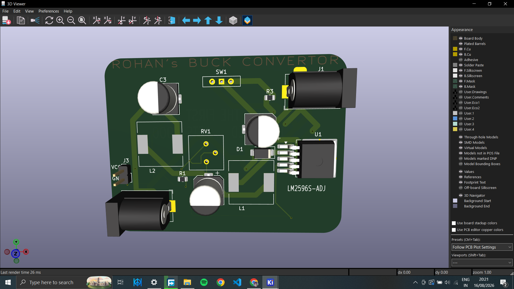
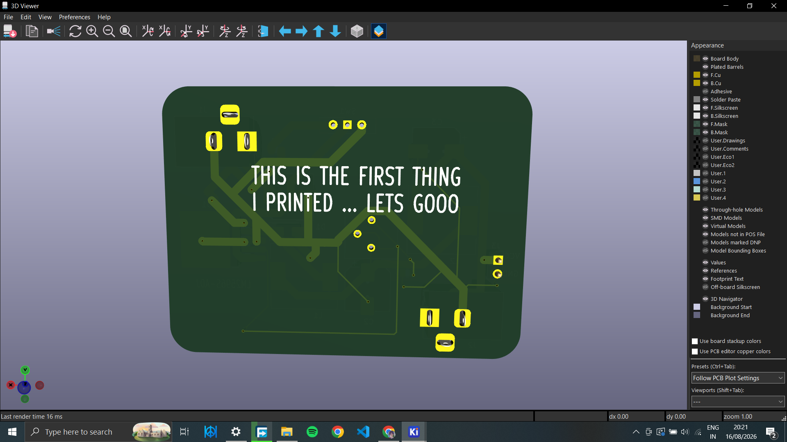
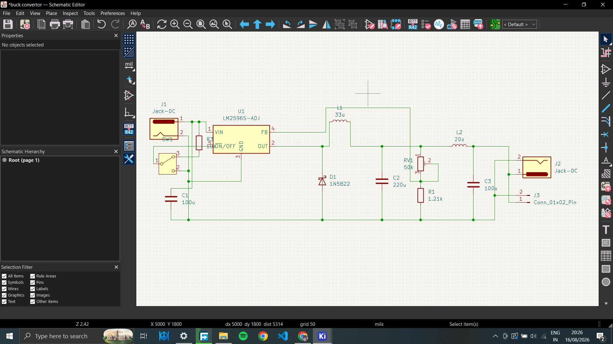

# CUSTOM_BUCK_CONVERTER
I Made a buck converter!! this is my first ever board i made!! took a whole day...
# LM2596 Adjustable Buck Converter PCB

A custom DC-DC buck converter PCB built for high-efficiency voltage step-down with secondary ripple filtering. Designed in KiCad.

## 📸 Project Renders & Screenshots

## ⚙️ Specifications & Features
- **Input Voltage:** 7V - 40V DC (via DC Barrel Jack `J1`)
- **Output Voltage:** Adjustable (1.23V - 35V) via 50k Trimpot (`RV1`)
- **Max Current:** Up to 3A
- **Filtering:** Secondary LC output ripple filter stage ($L_2 / C_3$) for low-noise output
- **Control:** SPDT power switch circuit on Pin 5 ($\overline{\text{ON}}/\text{OFF}$)

## 📁 Files Included
- `/Images`: Board renders and schematic screenshots
- `/Gerbers`: Production-ready `buck_convertor_gerbers.zip` for manufacturing
- `.kicad_pcb` / `.kicad_sch`: Complete KiCad design files
