# THIS IS MY HIGHSCHOOL PROJECT
I made a restaurant UI using python+tkinter
## HOMESCREEN
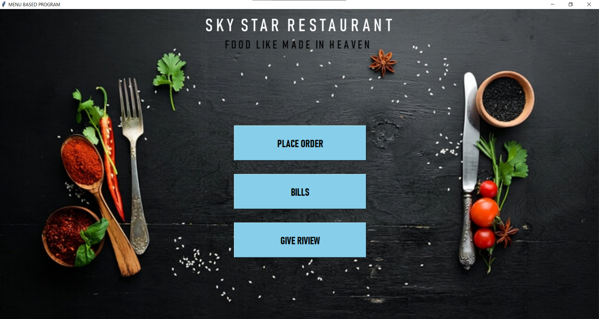
## you can place order from the menu
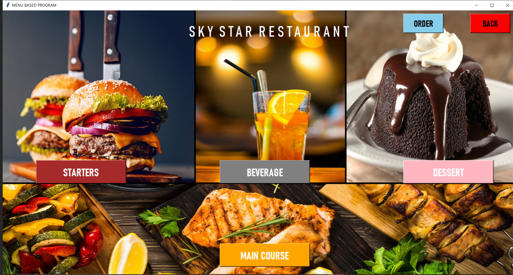
## there are multiple options
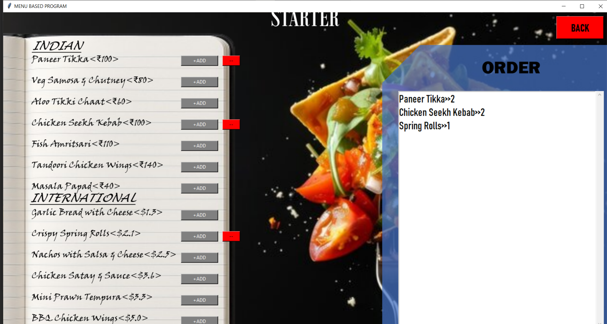
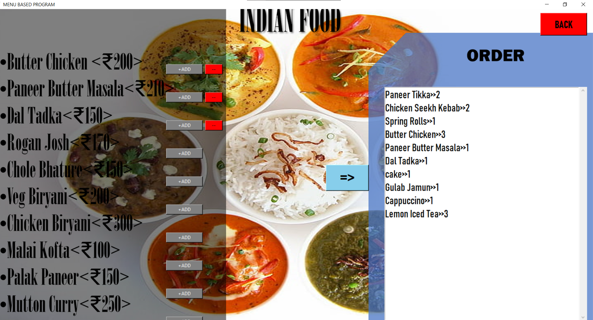
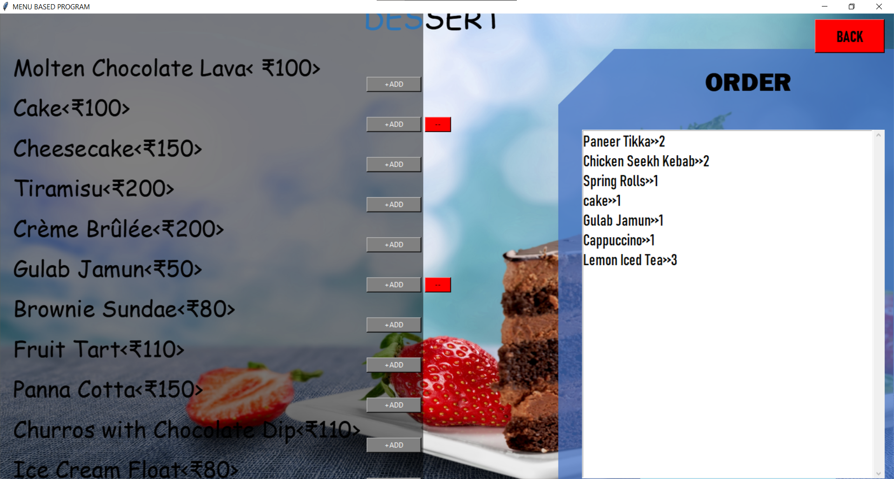
the selection is button based , clicking ADD includes the item instantly to the order and calculates the total bill  
removing the item is also done by clicking the "-" button next to the item's ADD button.  

### SAVING ORDER
the order is saved as a list to a binary file locally.  
## VIEWING ORDER
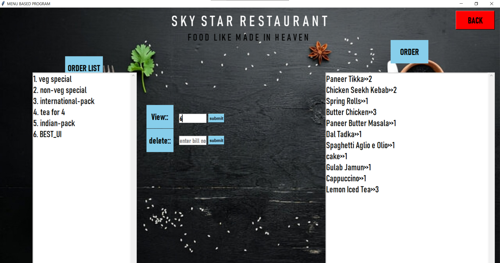
### viewing
orders saved in file are read and placed in a tkinter list , user choose the sno of order they want to pay
## PAYMENT WINDOW
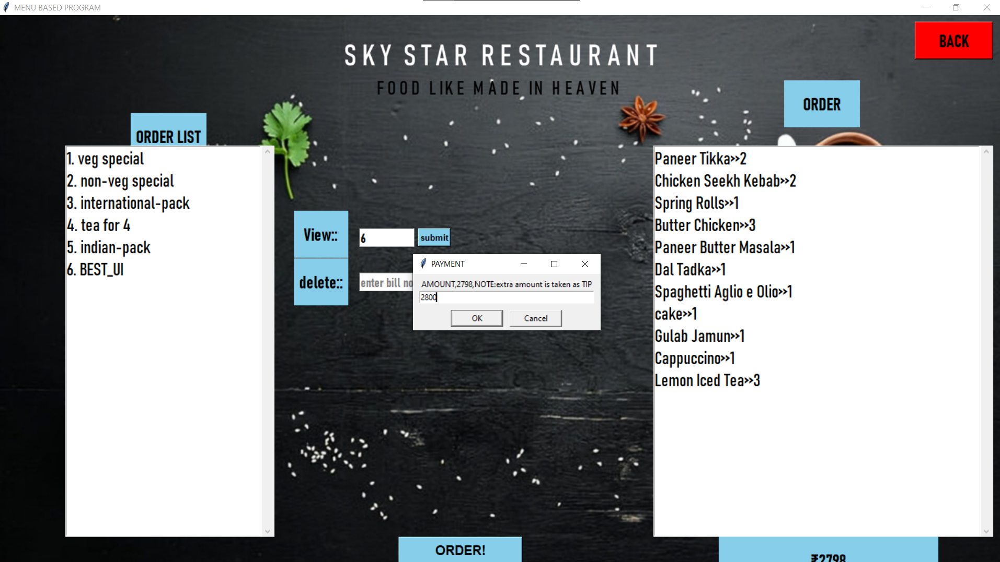
### payment 
payment is divided into three cases-
1. full payment : normal resopnse
2. underpayment : error response
   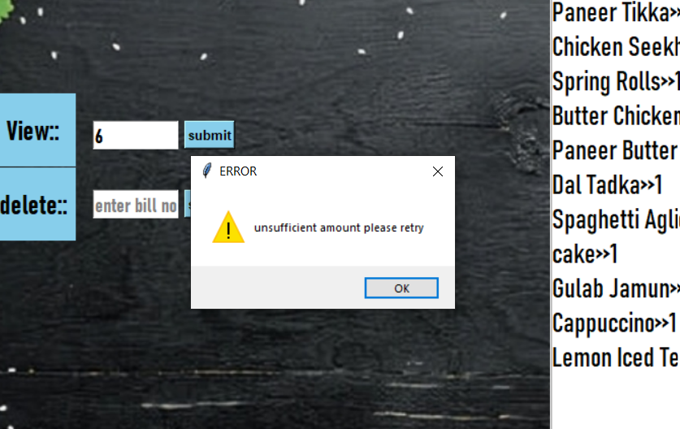
3. overpayment : thanking response(taken as tip)
   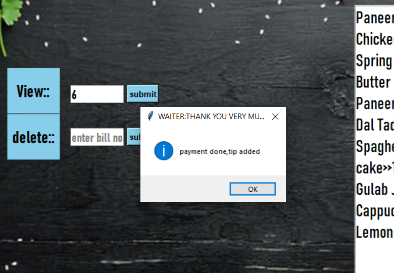
## FEEDBACK
feedback is the way the user can give review with a 5 star ratings + message , and their name
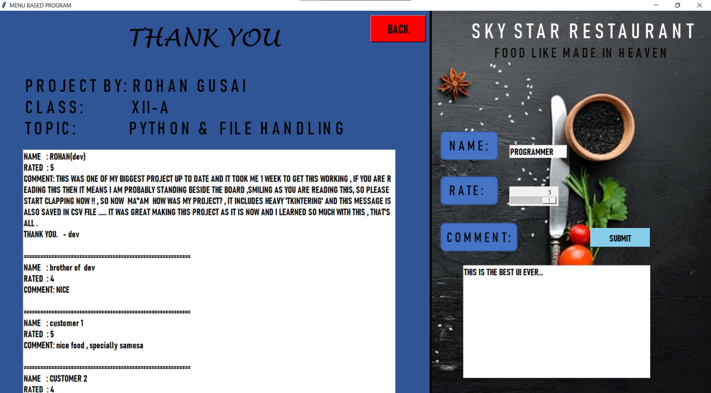
### REVIEW
The reviews are saved in a CSV file so it can be viewed on excel and stay organised,
the saved reviews can also be seen on the left panel.
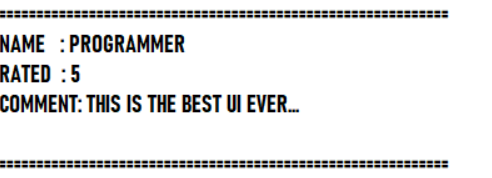
## OVERVIEW
This project covers the basics of file handling in python 
1. BINARY FILE : READING/WRITING
2. CSV FILE : READING/WRITING

  ### THANKYOU

